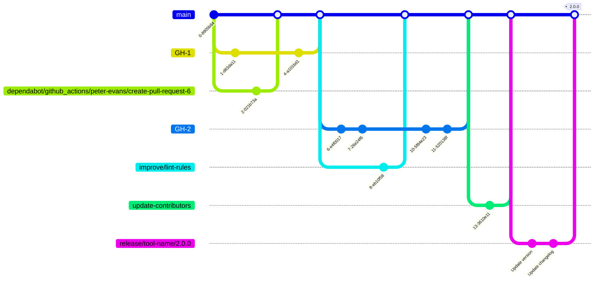

# Branch Strategy

## Branches

| Branch | Description |
| - | - |
| main | Production branch. |
| GH-{issue-number} | Used to work on an issue. |
| feature/{name} | Used to work on feature development other than issues. |
| improve/{name} | Used to work on improvements other than issues. |
| fix/{name} | Used to work on bug fixes other than issues. |
| release/{tool-name}/{version} | Release branch. When merged into the main branch, a {tool-name}-{version} tag is automatically pushed. |
| update-contributors | Exclusively occupied by a GitHub workflow dedicated to updating the Contributors section in the README. |
| dependabot/{target} | Exclusively occupied by Dependabot. |

## Example

